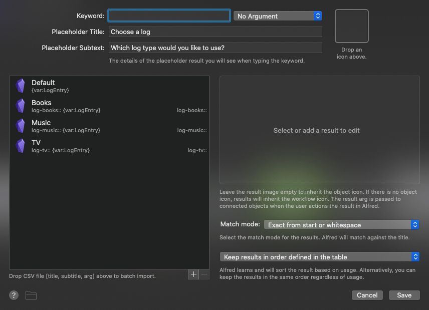
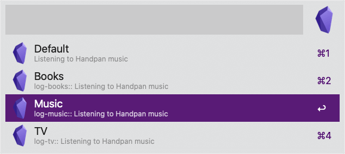

# Log to Obsidian

This Alfred workflow appends log entries to your Daily Note in Obsidian.

## Obsidian Setup

Install the [Advanced URI](https://obsidian.md/plugins?id=obsidian-advanced-uri) community plugin for Obsidian.

## Alfred Setup

Complete the following fields: 

- Keyword (to launch this workflow) 
- Vault Name (in Obsidian)
- Heading (to append to in your Daily Note) 
- Notifications (to trigger a notification via Notification Center or not)

In the Workflow, configure the List Filter object (highlighted in orange) to reflect your own setup and use case in Obsidian.

Each item in this list represents a type of log in Obsidian.

## Usage

Append log items to your Daily Note in Obsidian using the `olog` keyword (or your own keyword). 

Type your log entry and press <kbd>↩</kbd>

Then choose the log type:

Log entries will be appended in Obsidian in the format of a DataView style key pair.
e.g., `music:: Listening to Handpan music`

If you choose the Default log type, a log entry will be made with no key present.

If you find this Workflow useful you can can [donate on Ko-fi](https://ko-fi.com/G2G8UDJ4X).